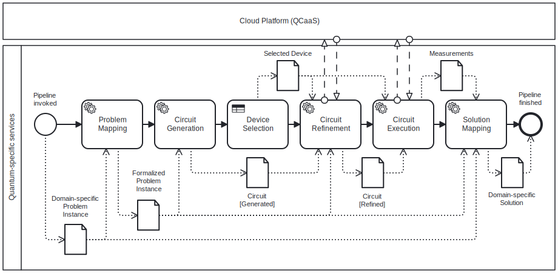
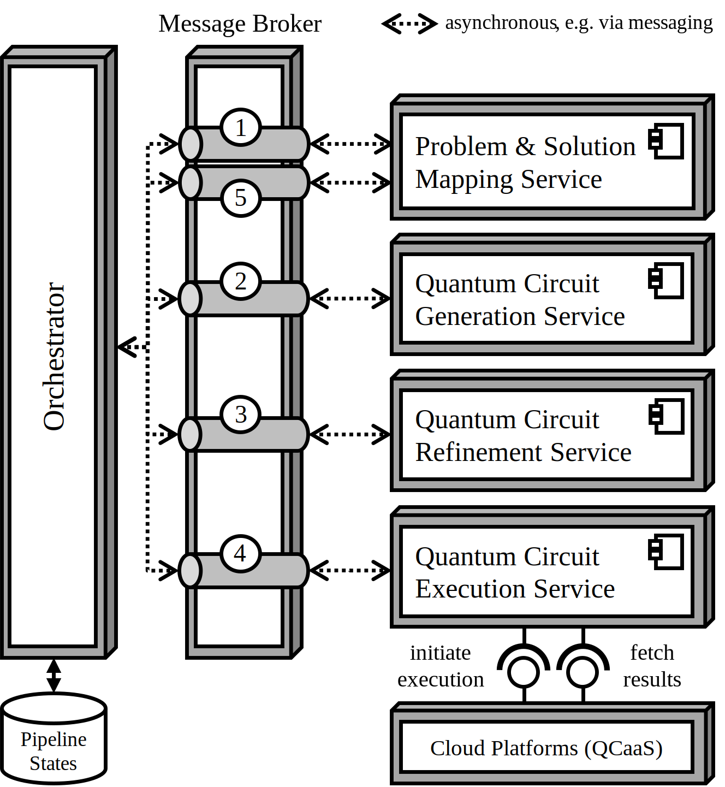

# A Reference Architecture for Embedding Quantum Software Into Enterprise Systems

DOI: [https://doi.org/10.1145/3748522.3779937](10.1145/3748522.3779937)

Marc Uphues, Sebastian Thöne, and Herbert Kuchen

## Abstract

Quantum computing promises a remarkable performance boost for certain applications, including computational intensive problems addressed by enterprise systems.
However, software architectures of enterprise systems must consider specific characteristics and quality attributes when collaborating with quantum computing services.
Hence, this paper presents a modular reference architecture for embedding quantum software into enterprise systems.
Its building blocks consist of loosely coupled and distributed services that implement both quantum-independent and quantum-specific tasks.
Although these services either depend on the business domain or the selected quantum algorithm, their orchestration forms a stable and reusable pipeline, specified as an executable BPMN model.
For demonstration and evaluation purposes, the proposed reference architecture is utilized in two case studies addressing combinatorial challenges from the field of operations research.

## Solution Approach
We propose a reference architecture for enterprise systems embedding quantum software.
Following a top-down approach, the overall design consists of two layers:
- The quantum orchestration pipeline,
- a modular service architecture responsible for handling the pipeline's tasks.

### Quantum Orchestration Pipeline
First, the quantum orchestration pipeline decomposes the sequence flow inherent in the utilization of quantum algorithms and organizes reoccurring tasks accordingly.
It includes previously identified quantum-specific tasks, as well as additional ones introduced to support fulfillment of suggested quality attributes.
The objective of this model is to provide a reusable pipeline.

### Task services
Second, a collection of loosely coupled and distributed services is intended to handle the specified tasks from the proposed pipeline.
An orchestrator determines the task sequence and controls the flow by assessing the pipeline model.
For the latter, the orchestrator distributes commands to the individual services via asynchronous communication.
Additionally, it tracks the state of each pipeline instance.
The objective of this architecture is to ensure the necessary characteristics and to incorporate the suggested quality attributes.

## Case Studies

For demonstration and evaluation purposes, we present two case studies exemplifying our proposals.
In each of these, we implement a typical enterprise system which embeds quantum software for solving a common combinatorial challenge from the field of operations research.
For their implementation, we utilize the proposed reference architecture.

### Nurse Scheduling Problem
As a first case study, we select the well-known Nurse Scheduling Problem (NSP).
It involves assigning employees to shifts in a way that satisfies multiple constraints.
To show the practical usability of our solution, we adapt this to a typical call center environment, where employees are also called "agents".

### Cargo Ship Container Composition (Knapsack)
As a second case study, we choose the knapsack problem.
It comprises the selection of items to maximize the total value of these selected items, while ensuring that their combined weight does not exceed a given capacity.
We adapt this to a common logistic scenario in which a cargo ship must be loaded with various containers, each differing in weight and value.
Given the ship's limited capacity, the goal is to determine an optimal composition that maximizes the total value without exceeding the capacity constraint.
